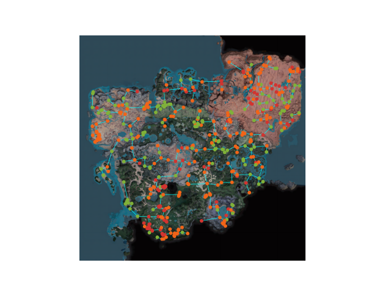
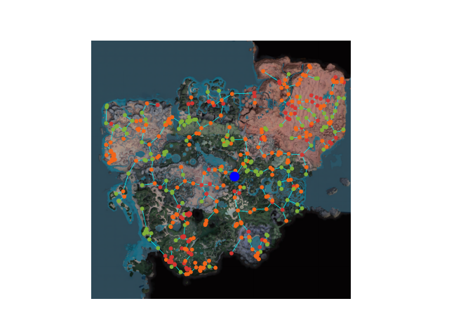

# Satisfactory MST

A script for plotting minimum spanning trees on resource nodes on the satisfactory map.

## Sample Minimum Spanning Trees
Taxicab distance with height
```sh
python mst.py -d l1_xyz -x -o l1_xyz.png 
```


Taxicab distance without height
```sh
python mst.py -d l1_xy -x -o l1_xy.png 
```

Euclidean distance with height
```sh
python mst.py -d l2_xyz -x -o l2_xyz.png 
```


Euclidean distance without height
```sh
python mst.py -d l2_xy -x -o l2_xy.png 
```


Euclidean distance with height with my base as a node
```sh
python mst.py -d l2_xy -x -b 90000 20000 -o l2_xy.png 
```


## Args
```
Computes a minimum spanning tree for all resource nodes with various options

positional arguments:
  filename

options:
  -h, --help            show this help message and exit
  -d {l2_xy,l2_xyz,l1_xy,l1_xyz}, --distance_measure {l2_xy,l2_xyz,l1_xy,l1_xyz}
                        The distance measure to use for the MST. l1 is taxicab distance, l2 is euclidean distance. xy to ignore heights of nodes, xyz takes      
                        hights into account.
  -b BASE_CORDS [BASE_CORDS ...], --base_cords BASE_CORDS [BASE_CORDS ...]
                        x y (z) cords of your base, will be included in the MST as a big blue dot
  -x, --headless        don't display the figure in a matplotlib window at the end.
  -o OUTPUT, --output OUTPUT
                        output path to save the mst image to a file.
```

## Data 

The data file, `resources.json` was extracted from [satisfactory-calculator.com's interactive map](https://satisfactory-calculator.com/en/interactive-map). The `map.png` file was also taken from them.  

